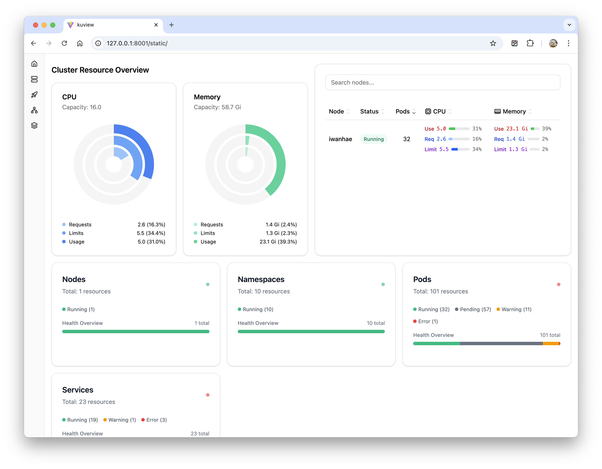

# KuView: A browser-based, real-time Kubernetes dashboard

[](https://youtu.be/4mpiOiLgfLE)

KuView is a real-time, read-only Kubernetes dashboard that runs entirely in your web browser. It provides an immediate and comprehensive overview of your cluster's status and resource utilization, with no server-side installation or `kubectl` plugins required for its primary mode of operation.

## Quick Start Guide

There are two ways to run KuView:

### 1. Run KuView locally with `kubectl proxy`

This method is ideal for quick, personal use without altering your cluster. Ensure `kubectl` is configured to access your cluster.

```bash
# Download and extract the latest release
curl -sL https://r2.iwanhae.kr/kuview/latest.tar.gz | tar xvz

# Initiate the dashboard
kubectl proxy -w ./dist
```

Navigate to **http://127.0.0.1:8001/static** in your web browser.

**That's it!**

### 2. Deploy on your cluster

This method provides better performance and is suitable for team usage.

```bash
# Create a namespace for KuView
kubectl create namespace kuview

# Create a ClusterRole for read-only access
kubectl create clusterrole kuview \
	--verb=get,list,watch \
	--resource=nodes,pods,pods/log,namespaces,services,\
	endpointslices.discovery.k8s.io,\
	nodes.metrics.k8s.io,pods.metrics.k8s.io

# Create a ServiceAccount for KuView
kubectl create -n kuview serviceaccount kuview

# Bind the ClusterRole to the ServiceAccount
kubectl create -n kuview clusterrolebinding kuview \
	--clusterrole=kuview \
	--serviceaccount=kuview:kuview

# Deploy KuView
kubectl create -n kuview deployment kuview --image ghcr.io/iwanhae/kuview:latest --port 8001
kubectl patch -n kuview deployments.apps kuview --patch '{"spec":{"template":{"spec":{"serviceAccountName":"kuview"}}}}'

# Expose the service as a NodePort (optional, you can use ingress or port-forwarding instead)
kubectl expose -n kuview deployment kuview --port 8001 --type=NodePort

# Now you can access KuView at http://<node-ip>:<node-port>/
```

### 3. Deploy with Local Helm Chart

This method allows you to deploy KuView using the Helm chart included in this repository. This is useful for customizing your deployment or integrating it into your own Helm-based workflows.

**Prerequisites:**
- Helm CLI installed.
- `kubectl` configured to your target Kubernetes cluster.

**Installation:**

1.  **Navigate to the chart directory (if you cloned the repository):**
    ```bash
    cd charts/kuview
    ```
    If you are using a packaged version of the chart, you can skip this step.

2.  **Install the chart:**
    You can install the chart into a specific namespace (e.g., `kuview`). If the namespace doesn't exist, Helm can create it for you with the `--create-namespace` flag.

    ```bash
    # Example: Install with release name 'my-kuview' in namespace 'kuview'
    helm install my-kuview ./charts/kuview --namespace kuview --create-namespace
    ```
    Or, if you are already in the `charts/kuview` directory:
    ```bash
    helm install my-kuview . --namespace kuview --create-namespace
    ```

    You can customize the installation by:
    *   Using the `--set` flag for individual values (e.g., `--set service.type=NodePort`).
    *   Creating a custom `my-values.yaml` file and using the `-f` or `--values` flag (e.g., `helm install my-kuview . -n kuview -f my-values.yaml`).

3.  **Accessing KuView:**
    The output of the `helm install` command will include NOTES with instructions on how to access your KuView deployment. These instructions will vary based on the service type configured (ClusterIP, NodePort, or LoadBalancer).

**Templating the Chart:**

If you want to see the generated Kubernetes manifests without actually deploying the chart, you can use `helm template`:

```bash
helm template my-kuview ./charts/kuview --namespace kuview > kuview-manifests.yaml
```
This will output all the Kubernetes YAML files that the chart would create, allowing you to inspect or modify them before deployment.

**Uninstalling the Chart:**

To uninstall the KuView deployment:

```bash
helm uninstall my-kuview --namespace kuview
```

## Core Features

- **Real-time Monitoring**: Observe live updates of resource states and events within your cluster.
- **Comprehensive Resource Visualization**: Visualize relationships between resources to gain a deeper understanding of your cluster's architecture.
- **Client-Side Operation**: Run anywhere with `kubectl` access. No cluster-side installation is required for the proxy-based approach.
- **Secure Read-only Access**: Ensures cluster safety with strictly read-only access, preventing any modifications to your cluster state.
- **Responsive User Interface**: Fully responsive UI for a seamless experience on desktops, tablets, and mobile devices.
- **Modern UI/UX**: Features a clean and intuitive interface built with React for an optimal user experience.

## For Development

Instructions for setting up a development environment.

### Wasm Development

For developing the WebAssembly-based client:

1.  Run `kubectl proxy` to connect to the Kubernetes API server.
2.  Run `npm run wasm` to build the Wasm binary.
3.  Run `npm run dev` to start the development server for the web client.

### Server-Side Development

For developing the Go-based server component:

1.  Run `go run ./cmd/kuview-go/main.go` to start the backend server.
2.  Run `npm run dev` to start the development server for the web client.

### Frontend Development

All routing logic is located in `src/App.tsx`, with page components in the `src/pages` directory. For a reference on resource visualization, see `src/pages/node.tsx`.

**Visualization Principles:**

1.  Each visualization should be encapsulated in a "Card" component within the `src/components/block` directory.
2.  All resource visualizations must be searchable. A common pattern is a two-part grid layout using the `Search` component from `src/components/block/search.tsx`. The `Node` page (`src/pages/node.tsx`) provides a good example.
3.  On a page, visualizations should be sorted by priority. Priority is defined as follows:
    - Potential for server failure (e.g., a pod in `CrashLoopBackOff` state).
    - Potential for performance bottlenecks (e.g., noisy neighbors on the same node).
    - Potential for security issues (e.g., a pod with excessive permissions).
4.  Use the `useKuview` hook to fetch Kubernetes resource data (e.g., `const nodes = useKuview("v1/Node");`).

### Backend Development

To support a new resource type, you need to modify both `cmd/server/main.go` (for server mode) and `cmd/wasm/main.go` (for local/WASM mode). The client-side is designed to adapt to these backend changes automatically.

## License

This project is released under a permissive open-source license. You are free to use, modify, and distribute it.

## Contributing

If you find this project useful, please consider giving it a star on GitHub. Contributions of any kind are welcome and greatly appreciated! 😉
